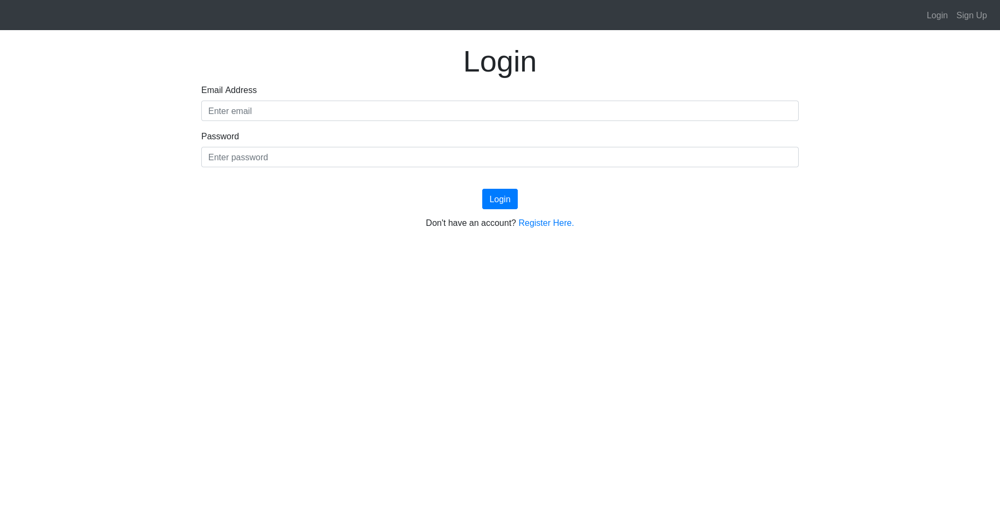
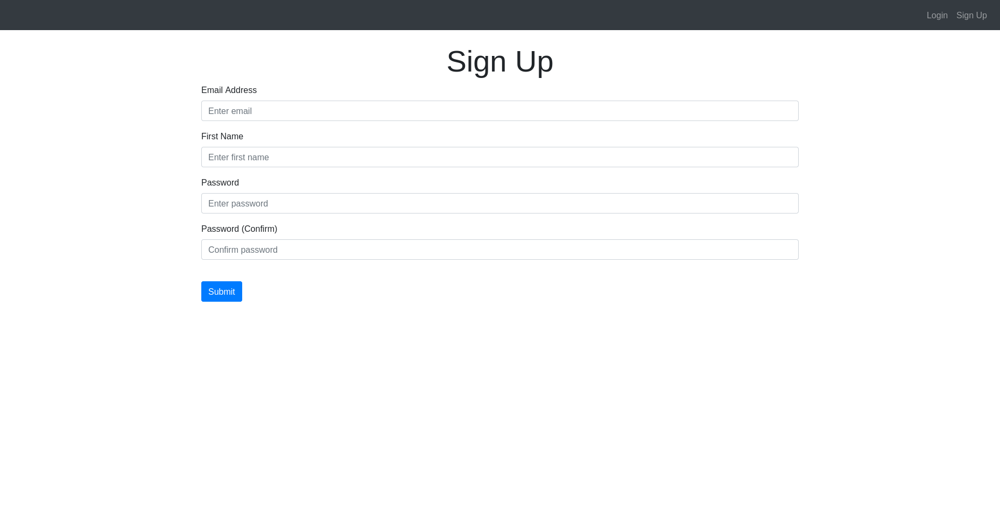
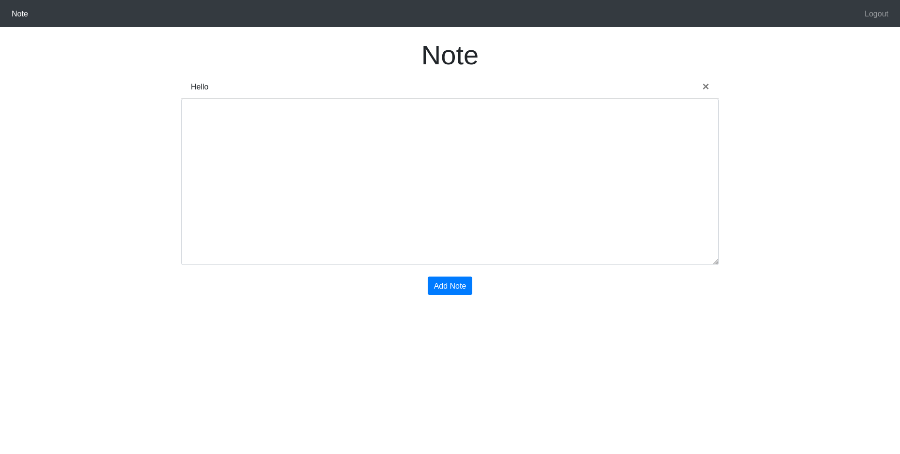

# Notes-web

`Python 3.10.6`

Note is a simple Flask web application that allows users to create notes after signing up and logging in. This project contains three pages: Login, Notes, and Signup.

### Prerequisites

Before running this project, make sure you have installed requirements.txt.

Installation

1. Clone this repository to your local machine.  
    `git clone https://github.com/p3rs1k/Notes-web.git`
2. Open the terminal in the project directory.
3. Create a virtual environment using.  
    `python3 -m venv venv`
4. Activate the virtual environment using  
(Windows) 
    `venv\Scripts\activate`  
or(Linux/Mac)  
    `source venv/bin/activate`
5. Install the dependencies using: 
`pip install -r requirements.txt`
6. Rename `.env-sample` to `.env` using:  
`mv .env-sample .env`
7. Paste your secret key into the `SECRET_KEY` variable
8. Run the app using python app.py.  
`flask run`
9. Open the app in your web browser at http://localhost:5000/.

Screenshots of the Login, Notes, and Signup pages.

